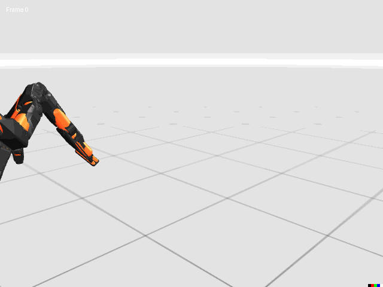
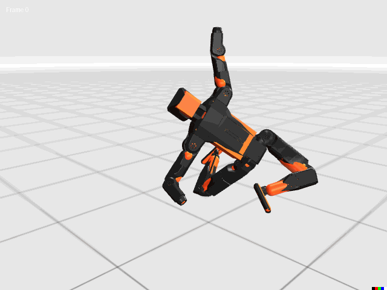
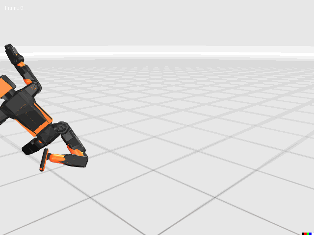

# TQC Humanoid Standing 🤖

**Training a humanoid robot to stand from a sleeping position using TQC (Truncated Quantile Critics) reinforcement learning with 20 degrees of freedom.**

## 📥 Download Checkpoints
**🎥 Watch the robot in action:** [Standing from Sleeping Position - YouTube](https://youtu.be/qmbfriJnpNM)

**📦 Get the trained model checkpoints:** [Google Drive Link](https://drive.google.com/file/d/1ddzZbv9Z843t1lIzMKRowMmLK8dIwmvi/view?usp=sharing)

## ⚙️ Installation

### Prerequisites
- **Python 3.11+** (required for ksim)
- **NVIDIA GPU** with CUDA 12 support
- **Ubuntu/Debian** (recommended)

```bash
# Install main packages (JAX will install compatible CUDA libraries)
pip install -r requirements.txt

# Important: Upgrade CUBLAS to fix GPU compatibility
pip install --upgrade nvidia-cublas-cu12==12.9.0.13
```

## 🎯 Project Overview

This project implements a custom TQC algorithm to train a humanoid robot to stand up from a lying position. The challenge involves coordinating 20 joints while maintaining balance and stability.

### Technical Specifications
- **Algorithm**: TQC (Truncated Quantile Critics) with 5 critics × 25 quantiles each
- **Architecture**: 
  - Actor: 51-dimensional observations (minimal state)
  - Critics: 462 + 20 dimensional inputs (rich state + actions)
- **Training Strategy**: 4:1 critic-to-actor update ratio for off-policy stability
- **Hardware**: RTX 4070 Ti with 512 parallel environments
- **Implementation**: Custom JAX-based replay buffer and policy networks
- **Timeline**: 3 months of continuous training and experimentation

### Key Technical Innovations
- **Action Scaling**: `scaled_action = tanh_action * action_range + self.action_bias` 
- **Critic Lag Handling**: Multiple critic updates per actor step
- **Simulation Stability**: 8 gradient steps per update with 256 batch size
- **Rich State Representation**: Contact sensing, IMU data, and force feedback for critics

## 🎭 The Learning Journey

### Attempt 1: The Fall


*First attempt... gravity wins this round!*

### Attempt 2: The Recovery  


*When life knocks you down, do a front roll! 🤸‍♂️*

### Attempt 3: Victory Dance


*Finally standing... time to celebrate! 🐵*

## 🏗️ Architecture Details

### Actor Network (51D → 20D)
- **Input**: Minimal observations (joint positions, velocities, IMU data)
- **Output**: Joint position commands for 20 DoF

### Critic Networks (482D → 25 quantiles)
- **Input**: Rich state (462D) + actions (20D) = 482D total
- **Output**: 25 quantiles per critic (5 critics total = 125 quantiles)
- **Features**: Contact sensing, force feedback, full state representation

### TQC Algorithm Benefits
- **Robust Q-learning**: Multiple quantile critics reduce overestimation bias
- **Truncation**: Drops highest quantiles for conservative value estimation
- **Off-policy**: Sample efficient with replay buffer

## 🚀 Training Configuration

```python
# Key hyperparameters
num_envs = 512                    # Parallel environments
batch_size = 256                  # Training batch size
critic_updates_per_step = 4       # 4:1 critic-to-actor ratio
gradient_steps = 8                # Multiple updates per step
num_critics = 5                   # TQC critics
num_quantiles = 25                # Quantiles per critic
rollout_length = 3.0              # Episode length (seconds)
```

## 📊 Current Results

The humanoid has made significant progress:
- ✅ **Stand up from lying position** - Successfully achieved!
- ✅ **Coordinate complex multi-joint movements** - 20 DoF coordination working
- ⚠️ **Balance stabilization** - Can stand but still working on maintaining stable balance
- 🔄 **Ongoing challenges**: Falls after standing due to balance control issues
- 🎯 **Next steps**: Requires additional training and reward shaping for stable standing

### Current Status: Standing Achieved, Stabilization In Progress
The robot can successfully transition from lying to standing, but maintaining prolonged stable balance remains a challenge requiring further development.

## 🛠️ Implementation Notes

- **JAX-based**: Full implementation using JAX for JIT compilation and GPU acceleration
- **Custom Buffer**: Functional replay buffer design for JAX compatibility
- **Contact Sensing**: Rich observation space including foot and body contact detection
- **Simulation Stability**: Careful tuning for stable training on consumer hardware

## 📈 Training Insights & Current Challenges

The 3-month training campaign revealed several key insights:
1. **Critic lag matters**: Off-policy methods benefit from multiple critic updates
2. **Rich state helps**: Detailed observations improve critic value estimation  
3. **Action scaling crucial**: Proper joint limit handling prevents policy collapse
4. **Standing transition success**: Robot learned complex get-up sequence effectively
5. **Balance control challenge**: Maintaining stable standing requires refined reward engineering

### Ongoing Work
- **Reward shaping**: Developing better balance-focused reward functions
- **Stability training**: Extended training specifically for post-standing balance

*The journey continues - standing achieved, perfect balance next!* 🎯